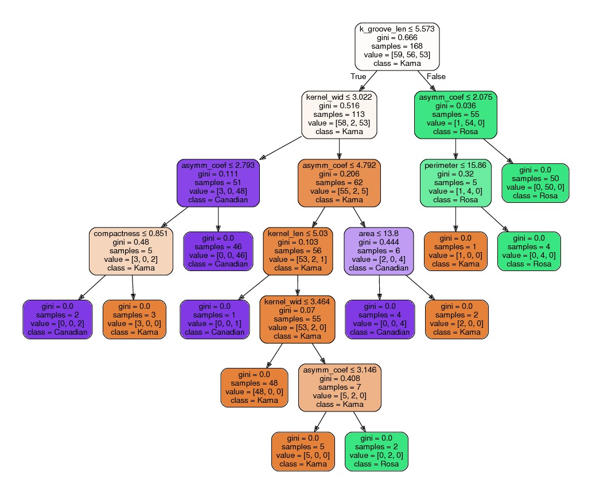

# Application of Decision Tree learning to classify Wheat kernels
Dataset Source- 
https://archive.ics.uci.edu/ml/datasets/seeds  

About the dataset: <ol>
	<li>To construct the data, seven geometric parameters of grains: area A [ mm 2 ] , perimeter P [ m ] , compactness C = 4πA / P^2 , length of kernel [ mm ] , width of kernel [ mm ] , asymmetry coefficient and length of kernel groove [ mm ] were measured from a total of 210 samples</li>
	<li>All samples are labeled by numbers: 1-70 for the Kama wheat variety, 71-140
for the Rosa wheat variety, and 141-210 for the Canadian wheat variety </li></ol>

Classification Algorithm used: Scikit-learn decision tree classifier  

## Results:
Detailed results are present in the file output.txt 
### Decision Tree obtained:

#### References:
[M. Charytanowicz, J. Niewczas, P. Kulczycki, P.A. Kowalski, S. Lukasik, S. Zak, 'A Complete Gradient Clustering Algorithm for Features Analysis of X-ray Images', in: Information Technologies in Biomedicine, Ewa Pietka, Jacek Kawa (eds.), Springer-Verlag, Berlin-Heidelberg, 2010, pp. 15-24.](http://www.ibspan.waw.pl/~pakowal/publikacje/Charytanowicz_et_al%20A%20Complete%20Gradient%20Clustering%20Algorithm%20for%20Features%20Analysis%20of%20X-ray%20Images.pdf)

